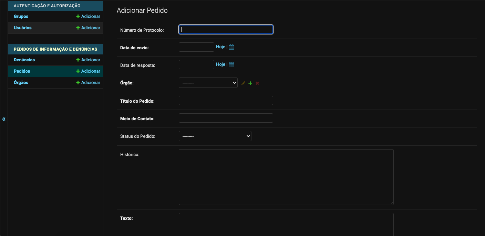

# Laiá

Laiá é uma aplicação onde você será capaz de cadastrar, atualizar, acompanhar o status dos seus **pedidos de informação** e **denúncias** disponibilizá-los publicamente.

Não sabe o que é um pedido de informação ou não sabe como fazer uma solicitação? Para saber mais, leia os artigos abaixo ⬇️

- [Como realizar um pedido de informação](https://dadosabertosdefeira.medium.com/como-realizar-um-pedido-de-informa%C3%A7%C3%A3o-35b3cf4e5dbd)

- [Solicitando dados via Lei de Acesso à Informação](https://escoladedados.org/tutoriais/solicitando-dados-via-lei-de-acesso-a-informacao/)

Nessa página você encontrará as seguintes insformações:

1. [Deploy](#deploy)
2. [Instalação e configuração do Laiá](#instalação-e-configuração-do-laia)
3. [Criando pedidos de informação](#criando-pedidos-de-informação)
4. [Como contribuir](#Como-contribuir)

## Deploy

Você pode facilmente usar o Laiá via deploy no Heroku ou imagem do Docker.

Para fazer o deploy via Heroku, basta criar ou acessar seu cadastro no [Heroku](https://id.heroku.com/login) e clicar no botão abaixo para Deploy:

[](https://heroku.com/deploy?template=https://github.com/DadosAbertosDeFeira/laia)

Você também pode fazer o deploy via Docker.

## Instalação e configuração do Laiá

Para instalar e configurar o projeto, recomendamos acessar as instruções contidas no nosso [repositório](https://github.com/DadosAbertosDeFeira/laia/blob/main/README.md).

## Criando pedidos de informação

Agora que o seu projeto está configurado, chegou a hora de criar usuários, inserir pedidos, órgãos e denúncias.

### Como criar um usuário

Antes de criarmos novos usuários, pedidos, órgãos e denúncias, certifique-se que você configurou o seu [super usuário](https://github.com/DadosAbertosDeFeira/laia/blob/main/README.md#crie-um-usu%C3%A1rio-para-incluir-seus-pedidos) no ambiente de produção. Sem o super usuário, não é possível acessar a página admmin do Laiá e consequentemente não será possível criar novos usuários, pedidos, órgãos e denúncias.

Agora que você já criou o seu super usuário, acesse a página [admin](http://0.0.0.0:8000/admin/auth/user/) com suas credenciais cadastradas.

A partir de agora, você poderá inserir novos usuários acessando a aba de [Usuários](http://0.0.0.0:8000/admin/auth/user/).

Para criar um novo usuário, clique em ADICIONAR USUÁRIO e preencha as informações de acesso (usuário e senha).


Além de usuários, é possível criar Grupos, que se tornam ferramentas essenciais para conseguir gerenciar o nível de acesso e permissões de cada usuário cadastrado, evitando assim tanto o acesso como a deleção de informações de forma errada.

Para criar um grupo, acesse o menu à esquerda da página, em AUTENTICAÇÃO E AUTORIZAÇÃO, e clique em Grupos.


Nomeie o Grupo e selecione as permissões para esse grupo. No exemplo acima, estamos criando um Grupo onde, usuários pertencentes à ele serão capazes de visualizar, adicionar e atualizar pedidos, órgãos e denúncias. Outras ações como deleção desses campos não é permitida.

Com essa ferramenta, você é capaz de filtrar o nível de permissão para gerenciar usuários, grupos, sessão, permissão e log.

Para inserir usuários aos Grupos, basta acessar os usuários criados no menu de AUTENTICAÇÃO E AUTORIZAÇÃO, e incluí-los em um ou mais grupos. Note que é possível editar as Permissões do Usuário manualmente também.

### Como criar um pedido de informação

Agora que os nossos usuários estão configurados, chegou a hora de criarmos os nossos pedidos de informação.

Você pode adicionar os pedidos individualmente ou múltiplos pedidos de uma vez só.

### Adicionando um pedido

Para adicionar um pedido, acesse a página [admin](http://0.0.0.0:8000/admin/) e clique em Pedidos.


Nessa Aba, você será capaz de visualizar todos os seus pedidos inseridos. Clicando em **ADICIONAR PEDIDO**, você acessará uma aba onde você irá preencher as informações do seu pedido. Note que os campos: Data de envio, Órgão, Título do Pedido, Meio de Contato e Texto são campos **obrigatórios**.



Caso o Órgão que você solicitou informações não conste nas opções, clique em "+" e um pop-up irá abrir. Preencha as informações do Órgão e salve suas alterações.


Com todas as informações preenchidas, clique em Salvar e pronto, você cadastrou um pedido!

### Adicionando múltiplos pedidos

No Laiá, é possível adicionar múltiplos pedidos de uma vez através de um arquivo `.csv` padronizado. Para a importação dos seus pedidos ser bem sucedida, recomendamos criar uma planilha baseada [neste](https://docs.google.com/spreadsheets/d/1Ly1XQIWbvh7bPpQEOeSlD_0rJ-Xcwn-8qg6mAu1OZdc/edit?usp=sharing) exemplo.

Com a planilha criada, importe o arquivo para a raiz do projeto. E rode o seguinte comando para importá-la automaticamente:

```bash
docker-compose run --rm web python manage.py import <aqui-o-seu-arquivo>.csv
```

Quando a importação for finalizada, você receberá a seguinte mensagem:

```bash
Concluído! Foram inseridos n pedidos de informação.
```

Obs: Quando inserimos múltiplos pedidos, não é necessário adicionar os Órgãos manualmente, durante a importação da planilha os mesmos são criados automaticamente com informações básicas de Nome, Sigla e Esfera.

### Informações importantes

- Um pedido está **sempre** relacionado a um Órgão, portanto, a deleção de um Órgão só poderá ser feita se todos os pedidos associados a ele também forem deletados.
